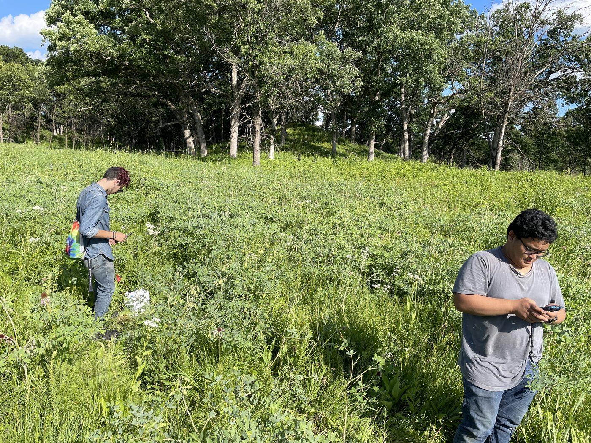
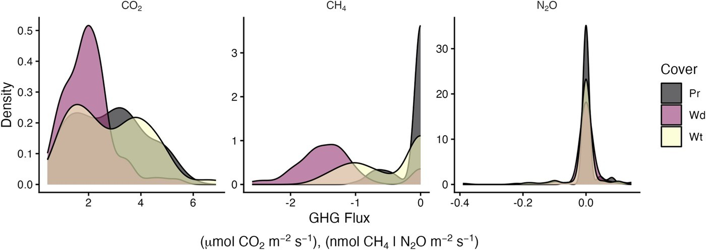
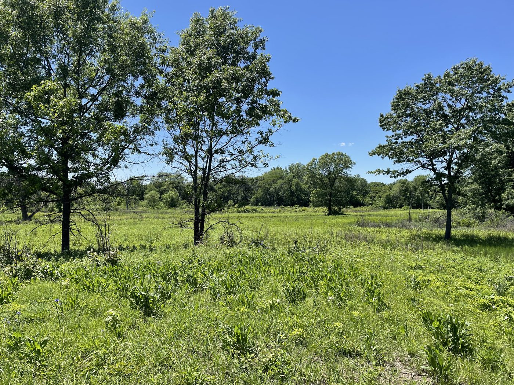
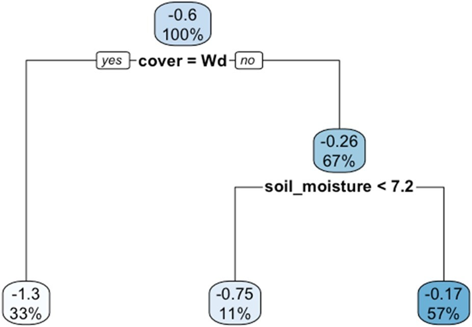
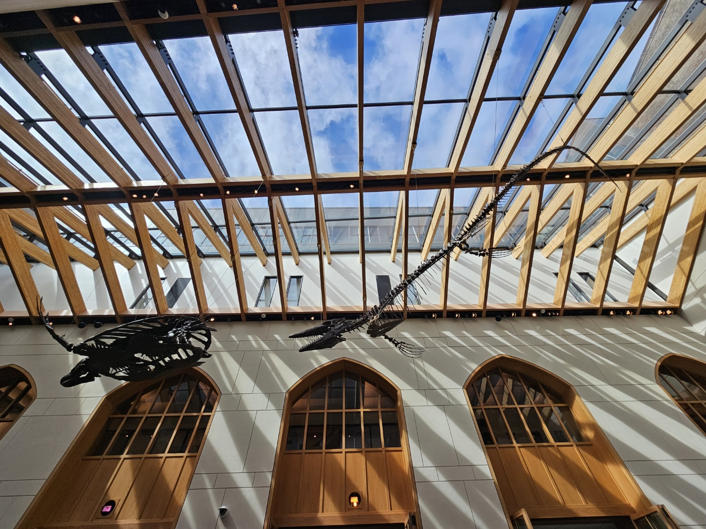
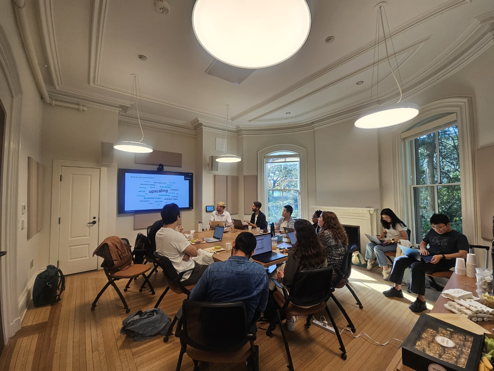
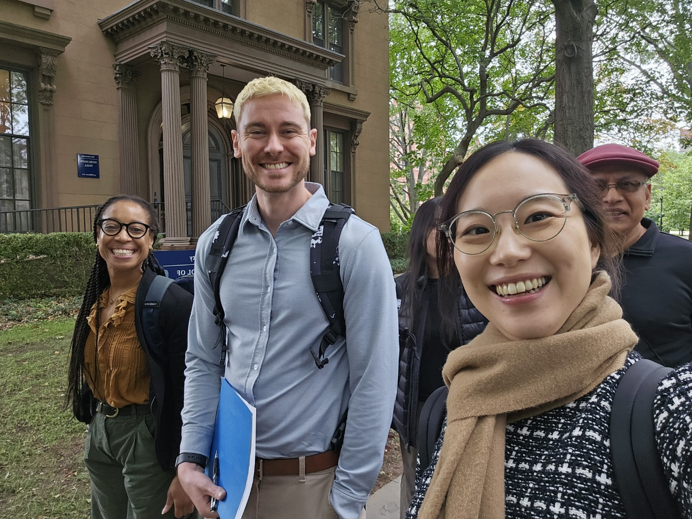
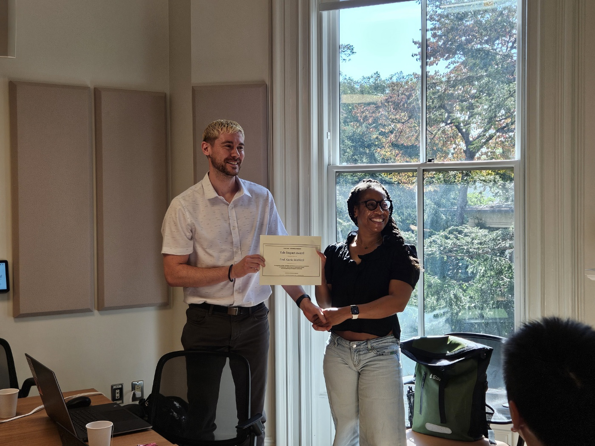

## Lab news

Updates from ecoϕlab and collaborators.

::: {.news-story}
### New paper from Nachusa Grasslands fieldwork

**October 6, 2026**

We're happy to share a new open-access paper from ecoϕlab and collaborators in *Frontiers in Environmental Science*. The work grows out of a 2022 field campaign at Nachusa Grasslands (Dixon, IL), where the team measured soil greenhouse gas fluxes—and their links to soil microbial communities—across restored oak woodland, open tallgrass prairie, and wet prairie.

{fig-alt="Two researchers standing in tall prairie vegetation at the woodland edge, checking handheld devices during fieldwork."}

Across the growing season, soils were consistent carbon dioxide sources, methane sinks, and roughly neutral for nitrous oxide. The headline finding is strong methane uptake—especially in woodland soils—while open prairie was often near neutral. Notably, even wet prairie showed no net methane emissions, which is unusual for saturated soils.

{fig-alt="Three density plots comparing soil carbon dioxide, methane, and nitrous oxide fluxes across prairie, woodland, and wet prairie cover types."}

Decision-tree models pointed to soil temperature as the main control on carbon dioxide, and to cover type plus soil moisture for methane uptake. Woodland soils were the strongest methane sinks; in prairie, uptake tended to be stronger when soils were drier.

{fig-alt="Sunny open prairie with scattered trees and a woodland edge under a clear blue sky at Nachusa Grasslands."}

{fig-alt="Decision tree showing woodland cover and soil moisture as the main splits explaining soil methane uptake."}

Inferred microbial communities were dominated by aerobic taxa—decomposers, nitrogen cyclers, and methane oxidizers—consistent with soils that consume methane rather than emit it. Together, the results suggest restored Midwest prairie–savanna ecosystems can act as net greenhouse gas sinks during the growing season, with woodland soils doing especially heavy lifting on methane.

The study was led by Gavin McNicol with coauthors Michael Yonker, Jack Breiter, Shamya Pugh, and D'Arcy R. Meyer-Dombard. Several of the student coauthors are now lab alumni—we're proud to see this chapter of the work in print.

You can read the article here: [doi:10.3389/fenvs.2026.1931059](https://doi.org/10.3389/fenvs.2026.1931059).

McNicol, G., Yonker, M., Breiter, J., Pugh, S., and Meyer-Dombard, D. R. (2026). Strong growing season soil methane uptake observed in a restored prairie-savanna. *Front. Environ. Sci.* 14, 1931059. doi: 10.3389/fenvs.2026.1931059
:::

::: {.news-story}
### AI Across Scales workshop at Yale

**October 2, 2026**

Last week, ecoϕlab PI Gavin McNicol co-hosted the **AI Across Scales** workshop at Yale with [Sparkle Malone](https://environment.yale.edu/) (Yale School of the Environment), bringing the AI for Natural Methane working group together for four days of talks, collaboration, and community.

The gathering ran September 29–October 2, 2026, with support from the Yale Center for Natural Carbon Capture and continuing support from Spark Climate Solutions. Sessions were held at the Yale Peabody Museum and the Yale Center for Geospatial Solutions, with hybrid links for remote participants. About 18 researchers joined in person and another 25 connected online, spanning Yale, UIC, Harvard, NASA, national labs, and partner universities.

{fig-alt="Bright atrium inside the Yale Peabody Museum with wooden skylight beams and suspended fossil skeletons."}

Day 1 opened with a public seminar and reception at the Peabody, followed by science talks and an open forum. Later in the week the group moved into working sessions—sharing tools, comparing approaches, and sketching next steps together.

{fig-alt="Researchers seated around a table with laptops during a workshop session at Yale."}

One highlight for visitors was a live demo of [WetLSP Explorer](https://github.com/McNicol-Lab/wetlsp-explorer-web-app/releases/latest), a desktop app from the lab that lets you explore wetland vegetation through the seasons on your own computer.

{fig-alt="Small group of workshop participants smiling outdoors in front of a Yale building."}

On the final day, Gavin also received a Yale Impact Award for helping organize the week—a nice note of thanks from the hosts.

{fig-alt="Gavin McNicol and a colleague holding a Yale Impact Award certificate."}

We're grateful to Yale, YCNCC, Spark Climate Solutions, the Peabody Museum, the Center for Geospatial Solutions, and everyone who traveled to New Haven or joined remotely.
:::
