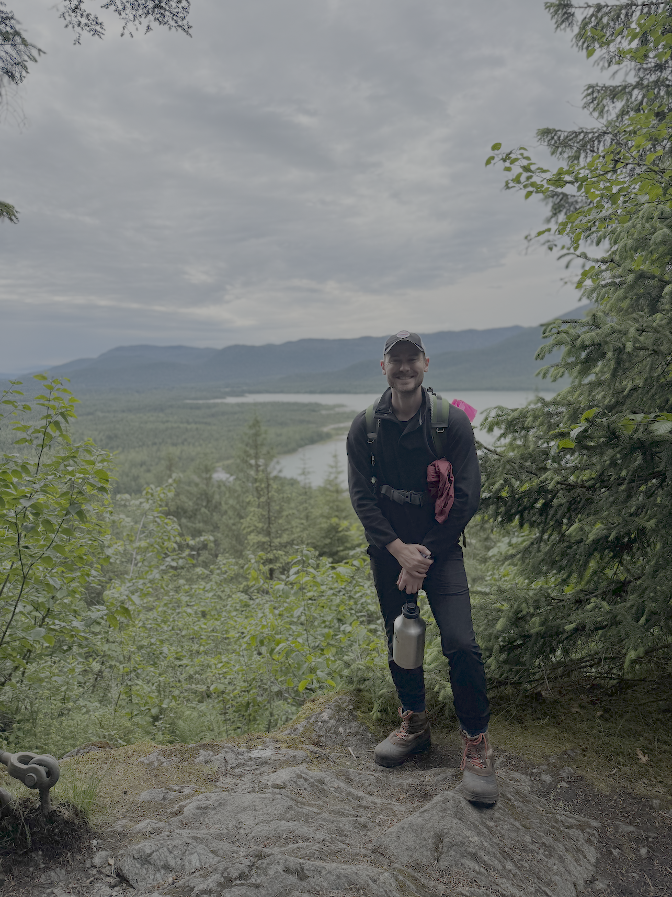
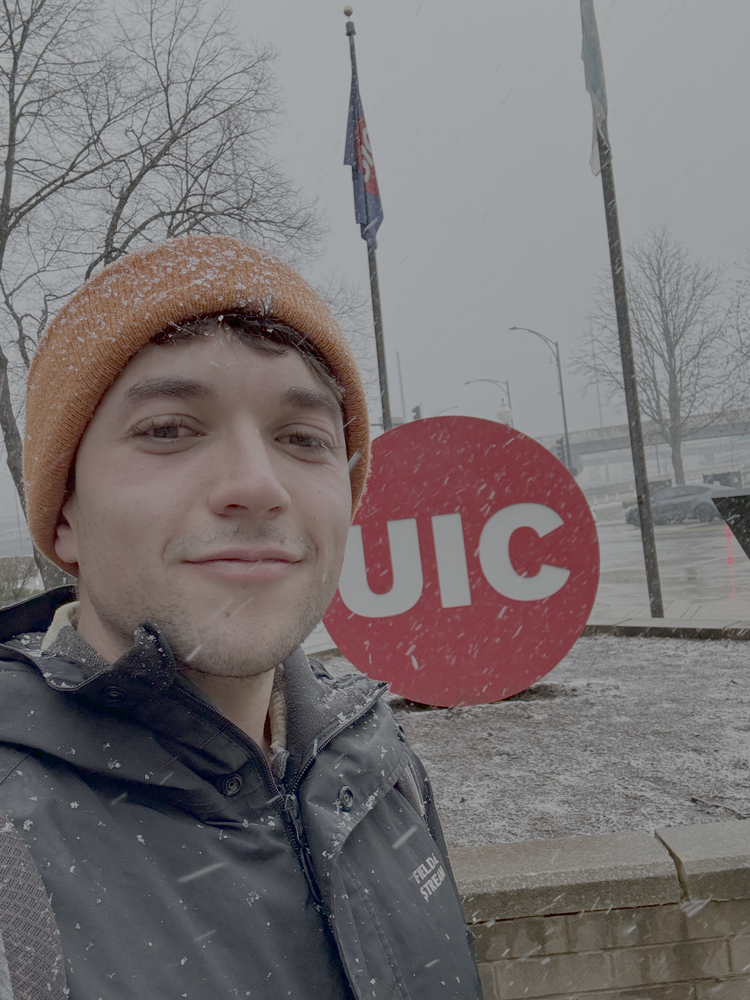
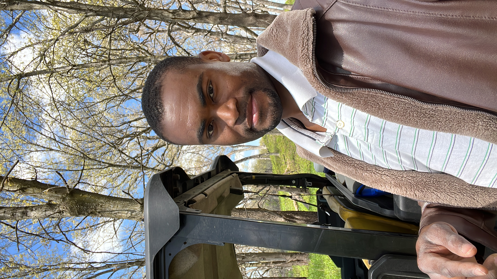
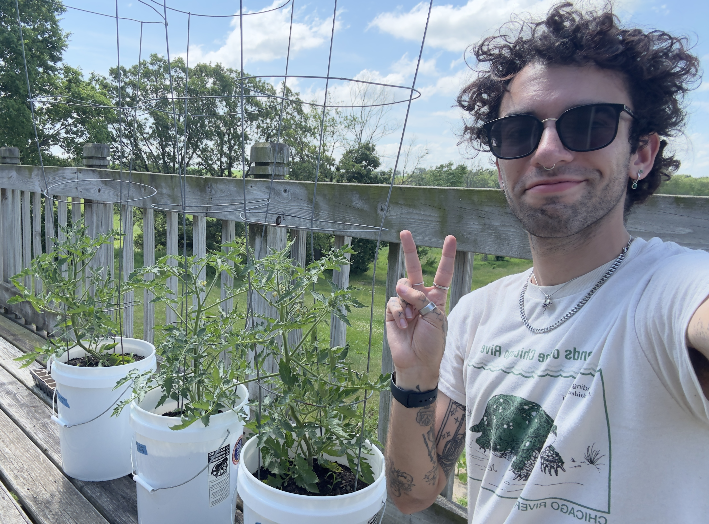
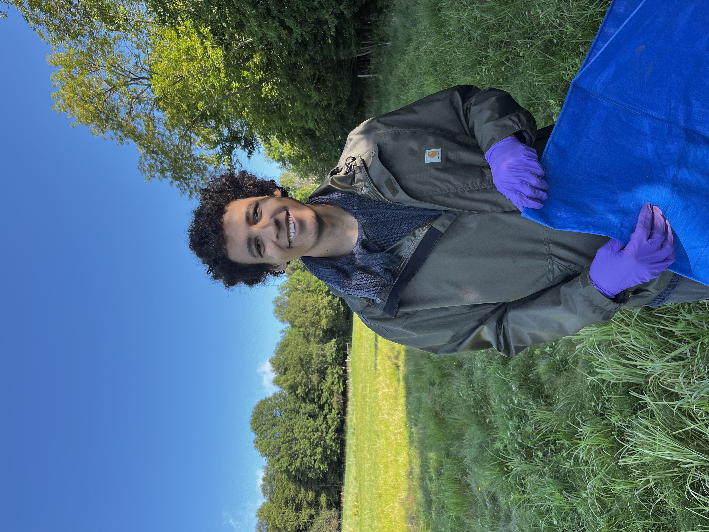
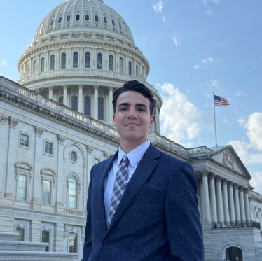
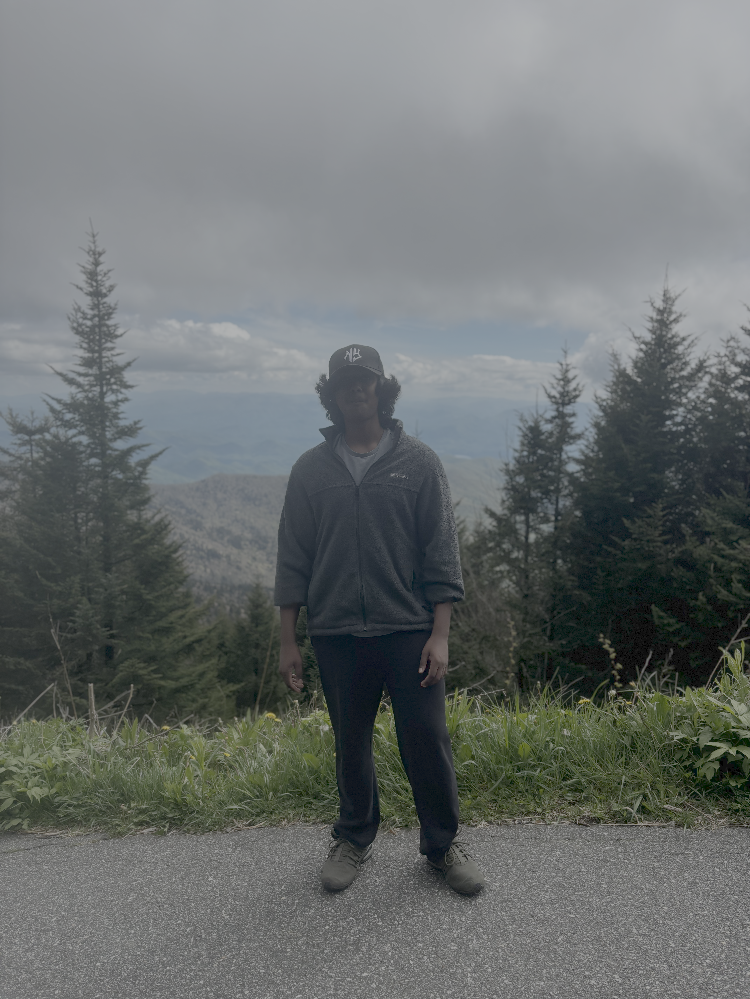
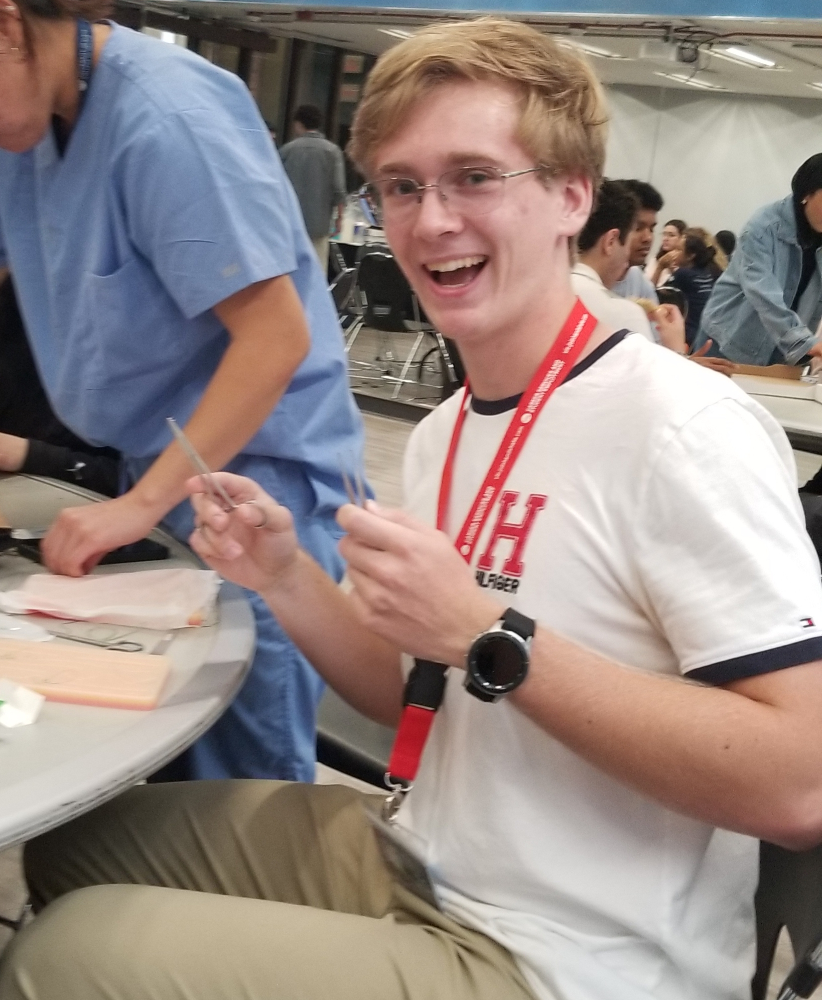

## Principal Investigator

### Prof. Gavin McNicol

::: {.grid}
::: {.g-col-6}

:::
::: {.g-col-6}
Hello! Thanks for visiting the ecoϕlab website. My interest in atmosphere-biosphere interactions began early in my life on the Isle of Skye, in the NW Highlands of Scotland. Our deforested landscape of sphagnum bogs, heather moorland, and post-glacial mountains is a dynamic watercolor scene that shifts in tone and hue with the passing seasons - sometimes more than one in a single day! These wet landscapes led me to a doctoral investigation of wetland carbon biogeochemistry in restored marsh ecosystems in the California Delta, followed by postdoctoral training to scale waste sector greenhouse gas avoidance, map rainforest soil carbon, and estimate global wetland methane emissions using bookkeeping and machine learning approaches. The biggest shift in my thinking since beginning at the University of Illinois Chicago is that I now believe our work must seek a harmonious balance between local conservation goals and global change concerns. I love spaceship Earth and hope we can improve our stewardship of it's incredible ecology. 
:::
:::

## Lab Manager

### Jack Breiter

::: {.grid}
::: {.g-col-6}

:::
::: {.g-col-6}
My name is Jack Breiter. I’m a Visiting Research Specialist and the acting Lab Manager for the ecoϕlab here at UIC. I graduated from the University of Illinois in 2021 and received my B.S in Environmental Sustainability. I’ve previously worked here at the ecoϕlab from 2022 through early 2024. I then proceeded to get some industry experience, specifically as a PE for a fire protection subcontractor. Full circle, now I’m back and started in Jan of 2026. I look to bring my previous skills, novel management experience from a high-stakes industry setting, and general curiosity into the lab to learn and share these experiences with everyone else!  

Some hobbies of my include reading, video games, journaling, and mostly anything physical outside. 
:::
:::

## Postdoctoral Research Associates

### Dr. Jessica Murray

::: {.grid}
::: {.g-col-6}

:::
::: {.g-col-6}
Jessica is an ecosystem ecologist who loves soil biogeochemistry. Her research interests include carbon-climate feedbacks, the role of canopy soils in forest processes, and the mechanisms of soil carbon stabilization. After over a decade working in the tropics, Jessica has taken her love for wet ecosystems to the coastal temperate rainforest as a postdoc for the ecophi lab. Her current research focuses on the effects of yellow-cedar decline on forest function.
:::
:::

## PhD Students

### Junior Jules Francois

::: {.grid}
::: {.g-col-6}

:::
::: {.g-col-6}
I am Junior Jules Francois, a PhD candidate in the ecoϕlab within the Department of Earth and Environmental Sciences at the University of Illinois Chicago. My research focuses on soil greenhouse gas fluxes in both natural ecosystems, such as prairies, and managed systems, such as urban agriculture. These landscapes provide important environmental benefits, including carbon sequestration, as well as ecosystem services such as food production and recreation. I am interested in understanding their individual and collective contributions to building more sustainable urban landscapes. I enjoy combining fieldwork and laboratory analysis, and I hope my research will help foster greater harmony between urban environments and the people who live in them.
:::
:::

### Michael Yonker

::: {.grid}
::: {.g-col-6}

:::
::: {.g-col-6}
Hi! I’m Michael, a PhD candidate in the ecoɸlab. My background is in civil engineering, but I've been more interested in biogeochemistry and ecology since I've started grad school. My research focuses on the tallgrass prairie and how different management practices affect ecosystem function in remnant vs. restored sites. In my free time, I like to play video games and take macro photos of plants.
:::
:::

### Aaron MacDonald

::: {.grid}
::: {.g-col-6}

:::
::: {.g-col-6}
Hi, my name is Aaron MacDonald, a PhD student the Earth and Environmental Sciences department. I completed my undergraduate degree at University of Toronto in "Forest Conservation Science" and "Biodiversity and Conservation Biology". I am interested in Yellow Cedar Decline in southern Alaska, and how it affects carbon flux. I am especially interested in how individual organisms and effects scale to the ecosystem level. I am also passionate about DEI in stem, and making sure everyone has a place.
:::
:::

## Undergraduate Assistants

### Dylan Janowski

::: {.grid}
::: {.g-col-6}

:::
::: {.g-col-6}
My name is Dylan Janowski, and I am an undergraduate student studying Earth and Environmental Sciences at UIC. I have experience in policy, education, lab work, and more. I enjoy using my skills to advance environmentally sound projects and legislation. In my free time, I'm an avid rock climber.
:::
:::

### Anirudh Iyengar

::: {.grid}
::: {.g-col-6}

:::
::: {.g-col-6}
Hello, my name is Anirudh Iyengar. I am an undergraduate studying Earth and environmental sciences at UIC. I am interested with paleontology and geophysics. I also like to work out and play badminton in my free time
:::
:::

### Nicholas Fedchuk

::: {.grid}
::: {.g-col-6}

:::
::: {.g-col-6}
My name is Nicholas Fedchuk, and I am an undergraduate student studying Biological Sciences at UIC. I am on an accelerated pre-med track and choose to place emphasis on honing my technical lab skills and technique in both chemical and biological settings. After my CNA certification, I continue to involve myself in the healthcare community through volunteering and clubs. Outside of the academic and pre-professional world, I love to do winter sports (mostly snowboard), hike, and exercise.
:::
:::
